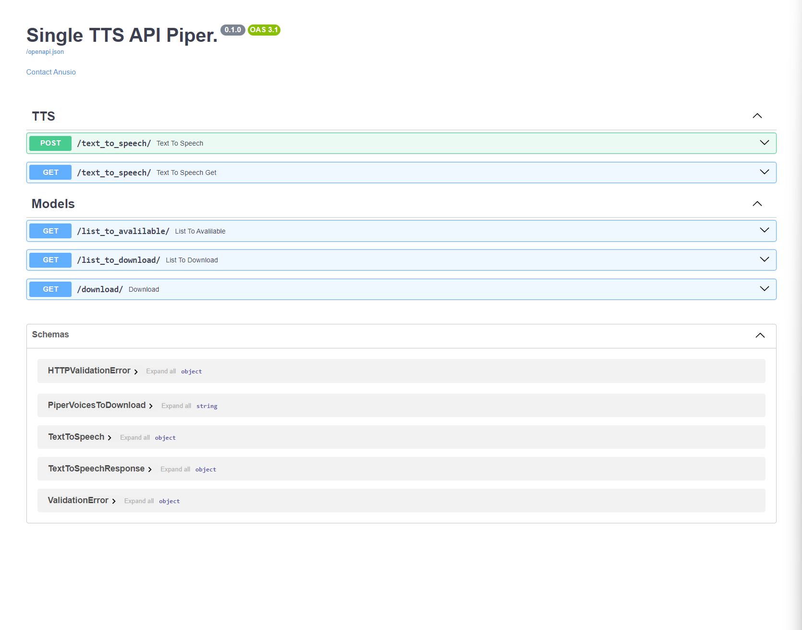
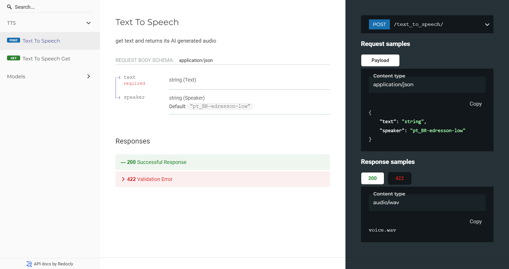

# Piper API (FastAPI)

It is a simple project to create a simple API interface to generate audio with AI known as Piper-tts from [https://github.com/rhasspy/piper](https://github.com/rhasspy/piper).

 - To update the available voices update the **piper_voices.md** with [piper download voices](https://github.com/rhasspy/piper/blob/master/VOICES.md) and execute the **update_piper_voices.py**.

 - Unfortunely piper does not work on windows properly, so use WSL.

### Run:
Build:

    docker build -t piperapi .

Using gpu:

    docker run -p 5501:5501 --gpus all --rm -it piperapi

Not using gpu:

    docker run -p 5501:5501 --rm -it piperapi

Or use docker compose, download docker-compose.yaml from the project:

    curl -O https://github.com/Anusio/PIPER-SIMPLE-API/blob/main/docker-compose.yml

Run: 

    docker compose up -d

To access localy:
    
    http://127.0.0.1:5501/docs

Documentation:

    http://127.0.0.1:5501/redoc

### TODO

 - [ ] Add endpoint to train a custom voice
 - [ ] Add suport to custom voices

